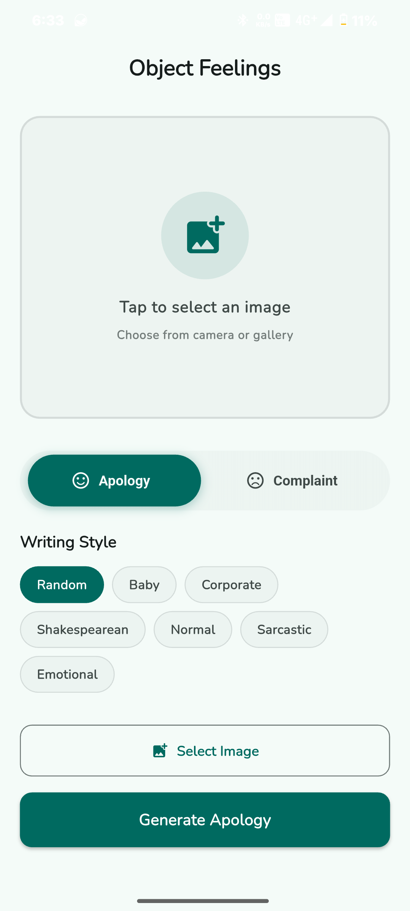
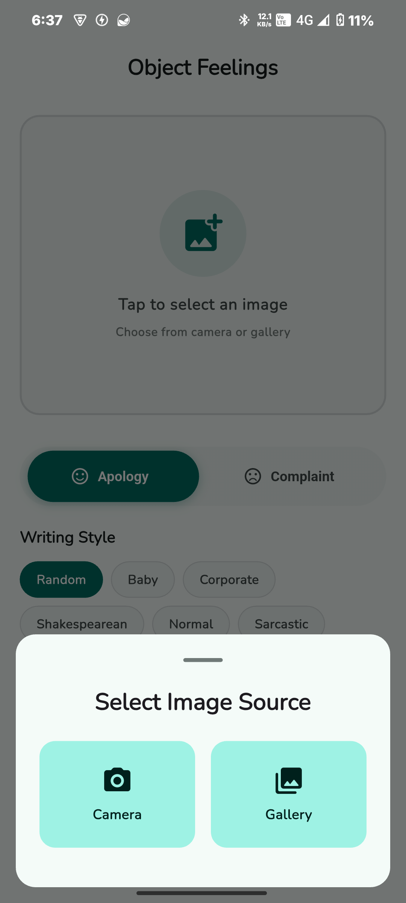
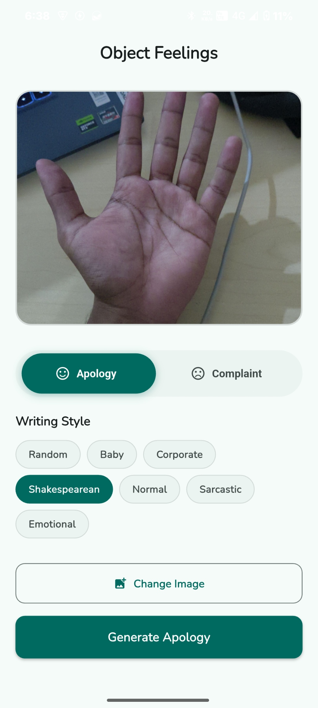
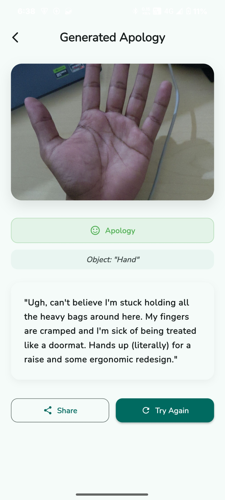
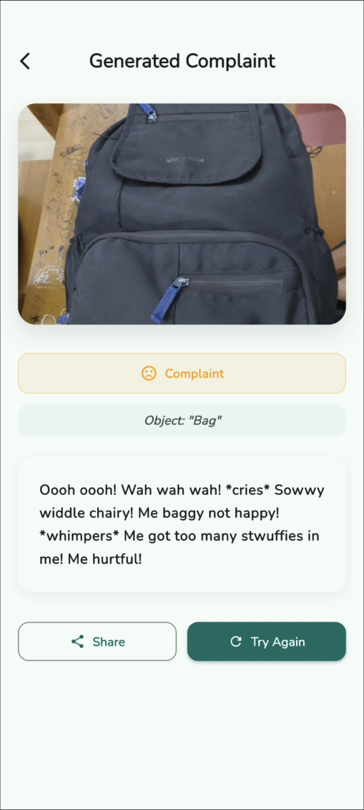

# FEELINGS‑AS‑A‑SERVICE (FaaS)

## 🦜 Basic Details

**Team Name:** Replicate
**Team Members:**
- Misva Anjal
- Farsana S

---

## 💡 Project Description

FaaS is a Flutter app that detects everyday objects (like bottles, pens or bags) using **Google ML Kit**, and then writes:
- A heartfelt **apology to** the object
- Or a dramatic **complaint from** the object’s perspective

Because object feelings matter too.

---

## 🤔 The Problem (that doesn't exist)

Objects don’t get hurt feelings.  
We’re giving them voices anyway.

---

## 🧩 The Solution (that nobody asked for)

You take a picture, the app recognizes an object, then… bam! It either apologizes to it or complains like it’s a living thing.

---

## Screenshots






## Videos
https://drive.google.com/file/d/1mD9_Rlz4WC-AuiNv4CBYTQJckzFX7UmL/view?usp=sharing
## 🛠️ Technical Details

### Software
- Flutter (UI framework)
- **Google ML Kit** — for on-device object detection
- HTTP requests to a Groq LLM API endpoint that generates messages (apologies/complaints)


### Hardware
- Android phone or emulator
- No weird sensors, just the camera

---

## 🧱 Installation

```bash
git clone https://github.com/your-username/faas.git
cd faas
flutter pub get
flutter run